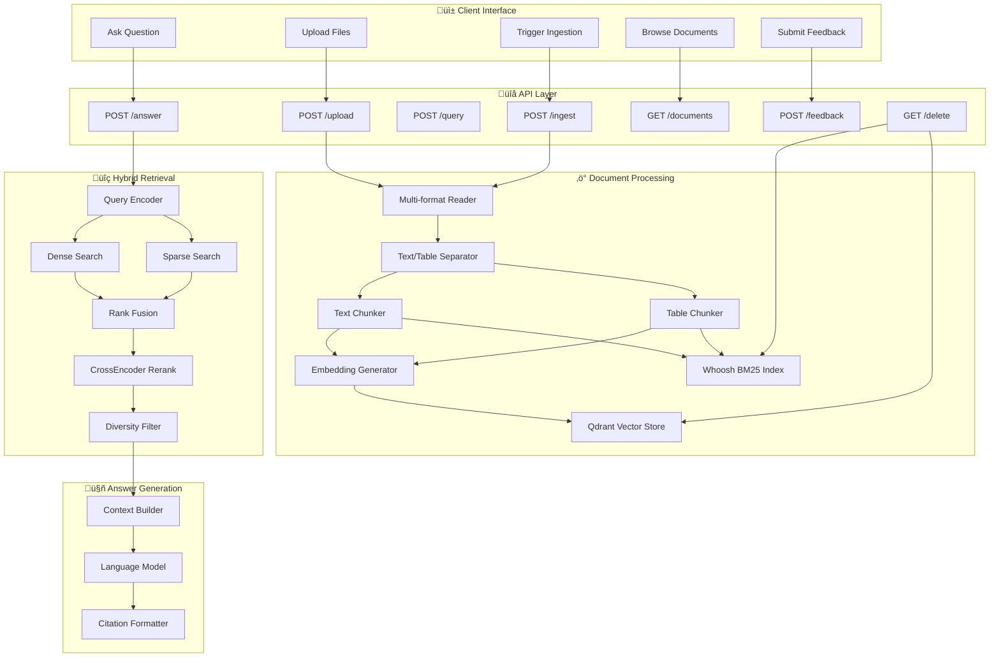

# 📚 Hybrid RAG Pipeline (Qdrant + BM25 + Reranker)
[](https://opensource.org/licenses/MIT)
[](https://www.python.org/downloads/)
[](https://fastapi.tiangolo.com/)

A production-ready **Retrieval-Augmented Generation (RAG)** system optimized for **notes, research papers, books, and tables**. This implementation combines the best of semantic search, keyword matching, and intelligent reranking to deliver highly relevant answers with precise citations.

## ✨ Key Features

* **🔄 Hybrid Retrieval Architecture**
  * Dense semantic search via **Qdrant** vector database
  * Sparse keyword search via **Whoosh BM25**
  * Intelligent fusion with **Reciprocal Rank Fusion (RRF)**

* **📊 Smart Document Processing**
  * Multi-format support (PDF, DOCX, TXT, MD)
  * Automatic table detection and separation
  * Independent chunking strategies for text vs. tables

* **🎯 Precision Enhancement**
  * **CrossEncoder reranking** for higher accuracy
  * Diversity filtering to reduce redundancy
  * Context-aware chunk selection

* **💬 LLM Integration**
  * Contextual answer synthesis
  * Inline citations with page references `[chunk_id p.<page>]`
  * Configurable response formats

* **📈 Production Features**
  * Comprehensive feedback system
  * Document management tools
  * Evaluation harness with standard metrics
  * Admin controls for collection management

## 🏗️ System Architecture



## 🚀 Quick Start

### Prerequisites

- Python 3.8+
- Docker (for Qdrant)
- 4GB+ RAM recommended

### 1. Installation

```bash
# Clone the repository
git clone https://github.com/yourusername/hybrid-rag-pipeline.git
cd hybrid-rag-pipeline

# Create virtual environment
python -m venv venv
source venv/bin/activate  # On Windows: venv\Scripts\activate

# Install dependencies
pip install -r requirements.txt
```

### 2. Start Qdrant Vector Database

```bash
# Using Docker (recommended)
docker run -p 6333:6333 -p 6334:6334 qdrant/qdrant

# Or using Docker Compose
docker-compose up -d qdrant
```

### 3. Launch the API Server

```bash
# Development mode with auto-reload
uvicorn main:app --host 0.0.0.0 --port 8000 --reload

# Production mode
uvicorn main:app --host 0.0.0.0 --port 8000 --workers 4
```

The API will be available at `http://localhost:8000` with interactive docs at `http://localhost:8000/docs`

### 4. Upload Your First Document

```bash
# Using curl
curl -X POST "http://localhost:8000/upload" \
  -F "file=@your_document.pdf"

# Trigger ingestion
curl -X POST "http://localhost:8000/ingest"
```

### 5. Ask Your First Question

```bash
curl -X POST "http://localhost:8000/answer" \
  -H "Content-Type: application/json" \
  -d '{"query": "What are the main findings in this document?"}'
```

## 📚 API Reference

### Document Management

#### Upload Document
```http
POST /upload
Content-Type: multipart/form-data

file: <PDF|DOCX|TXT|MD file>
```

#### Trigger Ingestion
```http
POST /ingest
```
Processes all files in the `data/pdfs` directory and indexes them.

#### List Documents
```http
GET /documents
```
Returns all indexed documents with metadata.

### Retrieval & Search

#### Query Documents
```http
POST /query
Content-Type: application/json

{
  "question": "What does table 2 show?",
  "k": 8,
  "mode": "table"  // optional: "text", "table", or "both"
}
```

#### Generate Answer
```http
POST /answer
Content-Type: application/json

{
  "query": "Summarize the key findings"
}
```

**Response:**
```json
{
  "answer": "Based on the documents, the key findings include...",
  "citations": [
    {
      "chunk_id": "doc1_chunk_3",
      "doc_title": "Research Paper.pdf",
      "pages": [2, 3]
    }
  ],
  "chunks": [
    {
      "chunk_id": "doc1_chunk_3",
      "content": "...",
      "score": 0.85
    }
  ]
}
```

### Feedback & Analytics

#### Submit Feedback
```http
POST /feedback
Content-Type: application/json

{
  "query": "original question",
  "answer": "generated answer",
  "feedback": "positive",  // "positive" or "negative"
  "notes": "Very helpful answer"
}
```

### Administration

#### Reset Collections
```http
GET /delete?mode=collection&recreate=true&wipe_whoosh=true
```

Parameters:
- `mode`: "collection" (reset vector store)
- `recreate`: true/false (recreate empty collection)
- `wipe_whoosh`: true/false (clear BM25 index)

## 🎨 Frontend Integration

### React Example

```jsx
import React, { useState } from 'react';

function RAGChat() {
  const [query, setQuery] = useState('');
  const [answer, setAnswer] = useState(null);
  const [loading, setLoading] = useState(false);

  const handleSubmit = async (e) => {
    e.preventDefault();
    setLoading(true);
    
    try {
      const response = await fetch('http://localhost:8000/answer', {
        method: 'POST',
        headers: { 'Content-Type': 'application/json' },
        body: JSON.stringify({ query })
      });
      
      const result = await response.json();
      setAnswer(result);
    } catch (error) {
      console.error('Error:', error);
    } finally {
      setLoading(false);
    }
  };

  return (
    <div className="rag-chat">
      <form onSubmit={handleSubmit}>
        <input
          type="text"
          value={query}
          onChange={(e) => setQuery(e.target.value)}
          placeholder="Ask a question about your documents..."
        />
        <button type="submit" disabled={loading}>
          {loading ? 'Searching...' : 'Ask'}
        </button>
      </form>
      
      {answer && (
        <div className="answer">
          <h3>Answer:</h3>
          <p>{answer.answer}</p>
          
          <h4>Sources:</h4>
          {answer.citations.map((citation, i) => (
            <div key={i} className="citation">
              📄 {citation.doc_title} (p. {citation.pages.join(', ')})
            </div>
          ))}
        </div>
      )}
    </div>
  );
}
```

## 📊 Evaluation & Benchmarking

The system includes a comprehensive evaluation framework:

```bash
# Run evaluation on a test dataset
python rag_next_steps.py eval \
  --data data/devset.jsonl \
  --out results/metrics.json \
  --k 10 \
  --mode hybrid

# Generate evaluation report
python rag_next_steps.py report \
  --results results/metrics.json \
  --output evaluation_report.html
```

### Metrics Computed

- **Recall@k**: Fraction of relevant documents retrieved
- **nDCG@k**: Normalized Discounted Cumulative Gain
- **MRR**: Mean Reciprocal Rank
- **Precision@k**: Precision at different cut-offs
- **Answer Quality**: LLM-based evaluation of generated responses

## ⚙️ Configuration

### Environment Variables

Create a `.env` file in the project root:

```env
# Qdrant Configuration
QDRANT_HOST=localhost
QDRANT_PORT=6333
QDRANT_COLLECTION_NAME=hybrid_rag

# Model Configuration
EMBEDDING_MODEL=sentence-transformers/all-MiniLM-L6-v2
RERANKER_MODEL=cross-encoder/ms-marco-MiniLM-L-6-v2
LLM_MODEL=gpt-3.5-turbo

# API Keys (if using external services)
OPENAI_API_KEY=your_openai_key_here
HUGGINGFACE_API_KEY=your_hf_key_here

# Performance Tuning
MAX_CHUNK_SIZE=1000
CHUNK_OVERLAP=200
TOP_K_RETRIEVAL=20
RERANK_TOP_K=10
```

### Advanced Configuration

Edit `config/settings.py` for advanced options:

```python
class Settings:
    # Chunking strategy
    CHUNK_SIZE = 1000
    CHUNK_OVERLAP = 200
    
    # Retrieval parameters
    DENSE_WEIGHT = 0.7
    SPARSE_WEIGHT = 0.3
    RRF_K = 60
    
    # Reranking
    ENABLE_RERANKING = True
    RERANK_TOP_K = 10
    
    # Answer generation
    MAX_CONTEXT_LENGTH = 4000
    TEMPERATURE = 0.1
```

## 🔧 Deployment

### Docker Deployment

```dockerfile
# Dockerfile
FROM python:3.9-slim

WORKDIR /app
COPY requirements.txt .
RUN pip install -r requirements.txt

COPY . .

EXPOSE 8000
CMD ["uvicorn", "main:app", "--host", "0.0.0.0", "--port", "8000"]
```

```yaml
# docker-compose.yml
version: '3.8'

services:
  qdrant:
    image: qdrant/qdrant
    ports:
      - "6333:6333"
      - "6334:6334"
    volumes:
      - qdrant_data:/qdrant/storage

  rag-api:
    build: .
    ports:
      - "8000:8000"
    depends_on:
      - qdrant
    environment:
      - QDRANT_HOST=qdrant
    volumes:
      - ./data:/app/data

volumes:
  qdrant_data:
```

### Production Checklist

- [ ] Set up proper logging and monitoring
- [ ] Configure authentication and authorization
- [ ] Implement rate limiting
- [ ] Set up backup strategies for vector database
- [ ] Configure HTTPS/TLS
- [ ] Monitor resource usage and scaling needs

## 🛣️ Roadmap

### Short Term (v1.1)
- [ ] Document-specific deletion endpoint (`DELETE /documents/{doc_id}`)
- [ ] Improved table QA with structured data analysis
- [ ] Web UI with citation highlighting
- [ ] Batch processing for large document sets

### Medium Term (v1.2)
- [ ] ElasticSearch backend option
- [ ] Multi-language support
- [ ] Advanced metadata filtering
- [ ] Real-time document updates

### Long Term (v2.0)
- [ ] Multi-modal support (images, charts)
- [ ] Federated search across multiple sources
- [ ] Advanced analytics dashboard
- [ ] Custom model fine-tuning pipeline

## 🤝 Contributing

We welcome contributions! Please see our [Contributing Guide](CONTRIBUTING.md) for details.

### Development Setup

```bash
# Install development dependencies
pip install -r requirements-dev.txt

# Run tests
pytest

# Run linting
flake8 src/
black src/

# Run type checking
mypy src/
```

## 📄 License

This project is licensed under the MIT License - see the [LICENSE](LICENSE) file for details.

## 🙏 Acknowledgments

- [Qdrant](https://qdrant.tech/) for the excellent vector database
- [Sentence Transformers](https://www.sbert.net/) for embedding models
- [Whoosh](https://whoosh.readthedocs.io/) for BM25 search capabilities
- [FastAPI](https://fastapi.tiangolo.com/) for the robust API framework

## 📞 Support

- 📧 **Email**: support@yourproject.com
- 💬 **Discord**: [Join our community](https://discord.gg/yourproject)
- 🐛 **Issues**: [GitHub Issues](https://github.com/yourusername/hybrid-rag-pipeline/issues)
- 📖 **Documentation**: [Full Documentation](https://your-docs-site.com)

---

**⭐ If this project helped you, please consider giving it a star!**